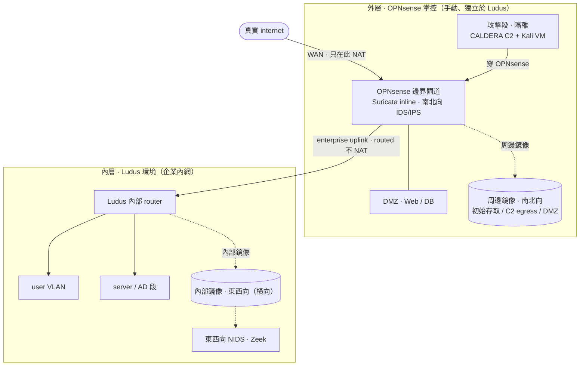

# locrian 實作規格（build-of-record）

偵測驗證 + 紅隊測試數位靶場的**實作規格**。這份是唯一施作依據,自足可執行。以祈使句寫成
「要做什麼」,不重述決策理由。

---

## 1. 目標與範圍

- **雙軌目的**：①**偵測回歸**（對偵測規則/引擎做可重現的回歸測試）②**紅隊測試驗證**。
- **核心立場：把靶場做成「錄音室」而非只是「舞台」。** 人工紅隊現場自由操作,但每次施作
  完整錄成 ground-truth artifact 集,可**離線重放進偵測引擎**做可重現回歸。一次演練同時
  餵養兩個目的。
- **不定位成 playground**：沒有評分紀律的 lab 會退掉「宣稱 vs 實測」這條脊椎。每次演練都
  要產出版本化評分結果。

## 2. 架構：兩層網路

**外層 OPNsense（手動、獨立於 Ludus）／內層 Ludus（企業內網）。**

**接線鐵律（實作時必守）：**

1. **攻擊段掛 OPNsense 一個獨立隔離介面**（非真 WAN、與真 internet 隔離）。攻擊機→受害機
   的流量**必須穿過 OPNsense 與鏡像點**,不得落在繞過 mirror 的路由上。
2. **OPNsense↔Ludus 內網走靜態路由、不 NAT**。Ludus 預設會 NAT 它的 range;若這一跳再
   NAT 一次,真實來源 IP 在**雙層 NAT** 裡被抹掉,PCAP 失去 IP 歸屬。NAT 只發生在
   「企業→真 internet」那道真邊界。
3. **雙鏡像點、無流量繞過**：周邊鏡像（OPNsense）錄全部南北向；內部鏡像（Ludus 內）錄
   東西向橫向 → 餵東西向 NIDS（Zeek）。每條南北向必過 OPNsense 鏡像、每條東西向必過內部鏡像。

**分層**：OPNsense 顧周邊 + DMZ + Suricata（IDS 給 Studio、切 IPS 給 Arena）;Ludus 內部
router 顧企業內部 VLAN（user/server 段）。OPNsense config.xml / Suricata 規則**帶外版控**。

## 3. 元件選型（build against）

| 用途 | 元件 | 佈署方式 |
|---|---|---|
| 虛擬化 + IaC 底座 | Proxmox + Ludus | Ludus CLI，單一 YAML，255 VLAN + router，快照回復 |
| 最外層邊界防火牆 | OPNsense（含 Suricata） | **手動建、獨立於 Ludus**，帶外版控 config |
| AD 目標網路 | GOAD | Ludus 原生 blueprint（多域/多森林，~40+ 攻擊路徑對映 ATT&CK） |
| 正常行為 baseline | GHOSTS（CMU/SEI） | server 用 `frack113.ludus_ghosts_server`；client **自寫 role** |
| SIEM / HIDS（受測偵測層核心） | Wazuh（OSSEC 後代，非 Elastic） | `aleemladha.wazuh_server_install` + `ludus_wazuh_agent` |
| 周邊 NIDS（南北向、簽章） | Suricata（隨 OPNsense） | inline，IDS/IPS 可切 |
| 東西向 NIDS（橫向、行為，可選） | Zeek | 內部鏡像餵入 |
| 端點遙測 | Sysmon + Wazuh agent | Ansible role 版本化 provision |
| Agentless 規則引擎（對照） | Zircolite | Phase 1 與 Wazuh 並用，直讀 EVTX |
| 偵測規則 | Sigma | 規則與引擎解耦，可移植到任何支援的引擎 |
| 自動化攻擊 + 自動記錄 | CALDERA（MITRE） | `frack113.ludus_caldera_server` + agent |
| 互動式人工攻擊 | Kali | range-resident VM，帶外遠端操作 |

**偵測堆疊分工**：Suricata 守周邊（南北向、已知簽章）、Zeek 守內網（東西向、行為）、
端點 sensor（Sysmon + Wazuh agent）守端點、Wazuh 當 SIEM/HIDS 集中與告警基礎。

## 4. 七要件 → 實作

1. **隔離可重現環境** → Proxmox + Ludus（單一 YAML，255 VLAN，快照回復）；C2/惡意元件關隔離網段。
2. **代表性目標網路** → GOAD（AD）+ DMZ（Web/DB）+ 檔案伺服器 + Proxy + N 台 Windows 端點 +
   Linux 伺服器；周邊 OPNsense 分段。⚠️ GOAD 是攻擊訓練取向、不擬真硬化企業防禦姿態,只填
   「目標」；是否在 GOAD 上補硬化以貼近正式環境為開放項（見 §11）。
3. **正常行為 baseline** → GHOSTS NPC，每個 NPC 對應 §5 帳戶模型的一個使用者。
4. **攻擊鏈 + 鑑識點** → §6 三條 TTP + §7 十一類鑑識點；人工 playbook，每步標 ATT&CK。
5. **流量/日誌可視化** → Port Mirror → sensors；集中化 → SIEM / 日誌管線；**外加全量
   ground-truth 錄製**（PCAP + 全量 EVTX/Sysmon）。OPNsense NetFlow 補 flow 層。
6. **評分表** → §9 擴充四態，每次演練版本化。
7. **遙測組態是先決條件** → audit policy / Sysmon config 用 Ansible role 版本化 provision,
   當受控變因（baseline 亦同）——避免「沒開稽核」被誤判成偵測漏抓。

## 5. 目標環境拓樸與帳戶模型

實作最小到完整拓樸的參考藍本（是 §6 每條 TTP 每一跳的地圖）：

- **DMZ**：Web / DB（Windows Server 2012 R2 等值）；WebGoat 類不安全網頁（IIS + MySQL）當 TTP2 弱點目標。
- **Intranet**：DC、檔案伺服器（FS）、端點 Pc01–05、一般使用者機（如 User19）。
- **帳戶模型**：Domain Admins（高權限，AD/MIS）與 Domain Users（user01–19）。
- **典型攻擊路徑**：`User19 中招 → PtH 至 MIS → PtH 至 DC`,每一跳對應具體主機。

GHOSTS 每個 NPC persona 對應此模型的一個使用者,讓劇情有日常行為襯底。

## 6. 攻擊鏈：三條 TTP

- **TTP1 — 竊取機敏文件**：釣魚 → 探勘 → RDP 爆破 → PtH → exfil。
- **TTP2 — 全網控制 + 永久後門**：WebShell + SQLi → Drive-by（CVE-2014-6332）→ MS17-010 →
  密碼重用 → PtH 至 DC → 後門。
- **TTP3 — 事後維運**：既有後門 → Kerberos Silver/Golden Ticket → PtH → 清軌跡。

攻擊施作是一條**粒度階梯**,各層打評分表不同格,**不指望單一工具打滿整張表**：

- **Atomic Red Team**（單元測試，單一技術隔離、系統性消 None）→ 最快的「TTP→Sigma→驗證」內圈。
- **CALDERA**（整合測試，鏈式 post-breach、自動記錄）。
- **GOAD**（多域 AD 舞台）。
- **人工 Kali**（探索式，創造性利用、初始存取、規避，找 Failed）。

Phase 1 建議先跑 **TTP1 竊密鏈**。

## 7. 十一類鑑識點 → sensor / logsource（Sigma 規則建構清單）

去重歸納自三條 TTP 每一步的可偵測訊號。**這張表是 Sigma 規則的施作清單**——每類逐條寫成
Sigma 規則,在對應 sensor 驗證：

| # | 偵測訊號類別 | 出現於 | 日誌來源 | 守備 sensor |
|---|---|---|---|---|
| 1 | 反向連線 / C2 beacon（端點不尋常外連特定 port） | TTP1[3,7,9]、TTP2[3,7] | 網路連線 / Zeek conn | 網路 + 端點 |
| 2 | 內網主機發現（大量 ARP 請求） | TTP1[4] | 網路側 | 網路 |
| 3 | 暴力登入（大量認證失敗） | TTP1[5] | Win Security 4625 | 端點 |
| 4 | 檔案完整性 FIM（原檔改惡意程式 / WebShell 新增 / 首頁竄改） | TTP1[6]、TTP2[2] | HIDS FIM / 檔案 | 端點 |
| 5 | 橫向移動 / 異常認證 PtH（低權限機用 local admin、UserX 登 DC） | TTP1[8]、TTP2[5,6]、TTP3 | Win Security 4624/4672 | 端點 |
| 6 | 持續化（新增不尋常帳號/服務） | TTP1[9]、TTP2[7] | Win Security 4720/4732/7045 | 端點 |
| 7 | 資料外洩（大量資料外傳外部 port） | TTP1[10] | 網路流量 + 端點外連 | 網路 + 端點 |
| 8 | 反鑑識 / 清除日誌 | TTP1[11]、TTP2[8]、TTP3[5] | Win Security 1102 | 端點 |
| 9 | 網頁攻擊（SQLi 繞驗證） | TTP2[2] | IIS / 網頁存取日誌 | 日誌集中（Web/Proxy） |
| 10 | 網路掃描（大量掃描 / MS17-010 掃描） | TTP2[1,4] | 網路側 IDS / Zeek | 網路 |
| 11 | Kerberos 票證濫用（Golden Ticket 於 DC 異常登入） | TTP3[4] | DC Security 4768/4769 | 端點（DC） |

訊號集中在 **Windows Security Log**（端點 sensor）與**網路連線/掃描**（網路 sensor）兩大來源。
攻擊技術皆可對應 ATT&CK（meterpreter reverse_tcp、PtH/psexec、MS17-010、drive-by、Mimikatz、
Golden/Silver Ticket、PowerSploit）。

**設計警惕**：曾有商用 ML 型內網偵測產品,在它白皮書宣稱的強項（Golden Ticket / PtH）實測
反而**漏抓**,逐步驟結果標 **Failed 而非 None**——有規則卻被繞過（ML 把攻擊學成正常事件、
簡單腳本爆破無既有特徵）。靠比較規則清單會系統性高估偵測涵蓋率。這是評分表必須守住
「Failed ≠ None」診斷區分的理由（見 §9）。

## 8. 錄音室機制與攻擊側佈局

### 8.1 一次演練要錄的三類 ground-truth

1. **全流量 PCAP** — Port Mirror（周邊 + 內部鏡像）。
2. **全量端點日誌** — EVTX / Sysmon。
3. **操作員逐步驟日誌** — 打時間戳、對應 ATT&CK 與 §7 十一類鑑識點：
   - 入侵後：CALDERA operation report。
   - 初始存取那一跳：Kali VM 本機 instrument（script/asciinema/shell history 或 RedELK）。

### 8.2 攻擊段佈局

- **CALDERA server 與 Kali VM 同置獨立攻擊段**（OPNsense 的隔離介面,攻擊者「在外」）。
- **CALDERA 定位是自動錄音機,不取代人工紅隊**：用其 **manual 模式**,操作員現場人工主導,
  CALDERA 在旁每步自動打時間戳、對映 ATT&CK、產 operation report。
- **CALDERA 是 emulation 不是 simulation**：真 agent 在真主機打真命令,落地 artifact 與人手打
  同種、可離線重放;但跑預定義劇本、無創造性利用,且**預設 assume-breach 不含初始存取**。
  → **初始存取那一跳靠人工 Kali**,入侵後的探勘/橫向/提權/竊密鏈由 CALDERA 自動施作兼記錄。
- **agent 佈署**：CALDERA agent（Sandcat）部在內網目標機;agent→server 的 beacon 必須跨
  OPNsense 才到攻擊段 server（否則同扁平 VLAN,C2 通聯訊號消失）。
- **beacon 偵測分工**：南北向 C2 egress → OPNsense Suricata;跨段橫向 + CALDERA
  peer-to-peer 中繼 → 東西向 NIDS（Zeek）。

### 8.3 人工 Kali 接入（range-resident VM + 帶外遠端操作）

- **攻擊機是靶場內的 VM,不是同仁實體筆電**。Kali（與 CALDERA）做成 Ludus 裡版本化、可快照
  的 VM;紅隊只遠端連進去操作。收穫：可重現（工具版本由快照固定）、記錄集中、時鐘同步靶場
  NTP（消除 clock skew）、無雙歸屬/意外橋接風險。
- **控制平面 vs 資料平面必須分開**（此模型最易踩的坑）：
  - `資料平面（要錄）= 攻擊機 → OPNsense/鏡像 → 受害內網`
  - `控制平面（不錄）= 操作員筆電 → WireGuard 帶外 → 攻擊機管理網卡`
  - 絕不讓操作員 SSH/RDP/CALDERA Web UI 流量混進當 ground-truth 在錄的鏡像,否則 PCAP 被
    遙控 session 污染。操作員走 **Ludus WireGuard 帶外管理通道**,在 OPNsense 上 port-forward。
- **多操作員歸屬**：共用一台 Kali 用 per-operator tmux/session 分,或一人一台 Kali 配不同
  靜態 IP;並行演練前先定好,否則 ground-truth 時間軸會糊。

### 8.4 母帶 vs 語料（儲存分層）

| 內容 | 定位 | 存哪 | 保留 |
|---|---|---|---|
| 原始 EVTX / PCAP | **母帶**（重） | 物件儲存 / NAS，**不進 git** | PCAP 全量 7–30 天，與事件關聯者長期封存 |
| 解析後 JSON 事件 | **版本化語料**（小、可 diff） | 獨立語料 repo（見下） | 長期，當回歸基準 |

- 語料組織照 Security-Datasets（OTRF）慣例：分 **atomic/compound 兩層**（對映 §6 粒度階梯）、
  每份附 **ATT&CK manifest + 模擬腳本**、事件走 JSON、整體 ZIP、GitHub 版本化。**不自訂。**
- 語料可經 **kafkacat / 重放工具送進你的日誌管線或 SIEM ingest** 當回歸基準。
- ⚠️ 格式張力：Security-Datasets 以解析後 JSON 為主,但部分偵測引擎離線重放要吃**原始 EVTX**。
  原則：**存的格式要對得上你的偵測引擎重新 ingest 入口**（見 §11 開放項）。

## 9. 評分：擴充四態

以 MITRE ATT&CK Evaluations 偵測分類法校準。MITRE 量「偵測品質」、locrian 量「規則涵蓋 vs
被繞過」,是不同軸。吸收 MITRE 的 Telemetry 態,守住 MITRE 沒有的 Failed 診斷區分：

| 態 | 意義 |
|---|---|
| **None** | 連遙測都沒有（盲區） |
| **Telemetry** | 有遙測但無規則（有資料、無告警） |
| **Failed** | 有規則但被繞過（**MITRE 沒有的診斷區分,locrian 差異化價值**） |
| **Success** | 命中 |

- **不跟進** 2026 TES 的單一量化分（0–2.0）——量化犧牲診斷力。守住診斷分類為主,量化為輔。
- Arena 模式加**反制維度**（偵測到但沒圍堵 / 偵測到且圍堵 / 漏掉）——YAGNI,到 Phase 2 再長。

## 10. 兩模式與路線圖

**兩模式共用同一套地基,分階段啟用。排序：量偵測在前、測反制在後**（要先有驗證過的偵測 +
評分基礎線,「偵測到能不能擋」才可量）。

- **Studio（預設、先做）**：藍隊被動受測,量偵測涵蓋。OPNsense Suricata 跑 **IDS**（被動,
  保住可比較性）。
- **Arena / 紫隊（疊上去、後做）**：藍隊現場反制,量反制/圍堵迴路（Wazuh active response、
  Sysmon EID 27/28 阻擋、OPNsense 切 **IPS**）。離線重放測不到,只有活對戰能測。

**原則：靶場對現成偵測層驗證,不綁任何特定產品。** 受測偵測層是現成的 Wazuh（SIEM/HIDS）+
Suricata（周邊）+ Zeek（東西向,可選）+ Zircolite/Sigma。錄下的 artifact 語料**產品無關、
可離線重放**,可送進任何吃 EVTX/PCAP/JSON 的偵測引擎做回歸。

- **Phase 0 — 地基**：Ludus + OPNsense + Wazuh + GHOSTS baseline + 全量錄製。
  → 逐步 checklist：[phase-0-checklist.md](phase-0-checklist.md)。
- **Phase 1 — Studio**：跑 TTP1,錄 artifact,對 Wazuh + Zircolite 產第一張評分表,把 §7 十一
  類鑑識點逐條寫成 Sigma 並驗證。交付：驗證過的可重放語料 + 評分法 + Sigma 規則集（產品無關）。
- **Phase 2 — Arena**：現成工具啟用反制迴路,評分表加反制維度。

## 11. 開放實作問題（build-time）

設計取捨已定,以下是落地時要實測裁決的具體項:

- **GHOSTS client role**：無現成 role,自寫（照 frack113 Windows agent pattern）。Phase 0 只做
  headless `Command` handler;GUI handler 需互動桌面 session,當增量。細節見
  [ghosts_client role](../ludus/roles/ghosts_client/README.md)。
- **GOAD 是否補硬化**：GOAD 不擬真硬化防禦姿態;是否在其上補硬化以貼近正式環境,待展開。
- **CALDERA operation report 欄位**：夠不夠細、能否對映 §9 評分表,待實測。
- **Kali 本機記錄結構化程度**：要多結構化才餵得回評分表、與 CALDERA report 時間軸如何對齊縫合。
- **帶外通道隔離**：是否真能把操作員 session 完全隔離在鏡像之外（Phase 0 就要驗）。
- **artifact 格式裁決**：「存解析後 JSON / 存原始 EVTX / 兩者都存」最終取捨;原則：存的格式要
  對得上你的偵測引擎重新 ingest 入口。
- **atomic/GOAD 攻擊路徑 ↔ §7 十一鑑識點 ↔ §6 三條 TTP 的逐項對映**：尚未比對。
